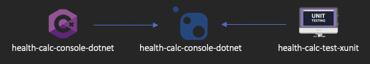

# Projeto final - Engenharia de Software

# Diagrama (macro) do projeto


                               

# Arquitetura

<https://social.technet.microsoft.com/wiki/contents/articles/36655.onion-architecture-in-asp-net-core-mvc.aspx>

# Design Pattern

<https://www.dotnettricks.com/learn/designpatterns/strategy-design-pattern-c-sharp>

# health-calc-pack-dotnet-braulio-seabra

Projeto final do curso de Pós-Graduação em Engenharia de Software da PUC-MG. Trata-se de um pacote NuGet para cálculo de IMC (Índice de Massa Corporal) e Macronutrientes.

## Classes

* IMC - Responsável pelo cálculo e pela classificação do IMC (Índice de Massa Corporal).

    * Calc

        ```public double Calc(double Height, double Weight)```


    * GetIMCCategory

        ```public string GetIMCCategory(double IMC)```


    * IsValidData

        ```public bool IsValidData(double Height, double Weight)```


* Macronutriente - Responsável pelos cálculos dos três componentes que formam o grupo de macronutrientes: carboidratos, proteínas e gorduras.

    * Calc

        ```public MacronutrienteModel Calc(SexoEnum Sexo, double Height, double Weight, NivelAtividadeFisicaEnum  nivelAtividadeFisica, ObjetivoFisicoEnum objetivoFisico)```

    * IsValidData

        ```public bool IsValidData(double Weight)```


# health-calc-text-xunit

Projeto responsável pelos testes unitários funções desenvolvidas no projeto health-calc-pack-dotnet-braulio-seabra.


## Classes

   * IMCTest – Responsável pelos testes unitários dos cálculos e pelas classificações do IMC (Índice de Massa Corporal).
   * MacronutrienteTest – Responsável pelos testes unitários dos cálculos dos três componentes que formam o grupo de macronutrientes: carboidratos, proteínas e gorduras.

# health-calc-console-dotnet

Console Application que faz uso do pacote health-calc-pack-dotnet-braulio-seabra para demonstrar o cálculo do IMC e dos macronutrientes a partir de dados digitados pelo usuário.

# Pacote


<https://www.nuget.org/packages/health-calc-pack-dotnet-braulio-seabra/>

# Como usar?

1. Clonar o repositório Git;
2. Realizar o build do projeto health-calc-pack-dotnet-braulio-seabra;
3. Executar a aplicação em modo console através do projeto health-calc-console-dotnet.
Importante: 
    * Informar a altura em metros e o peso em Kg.


